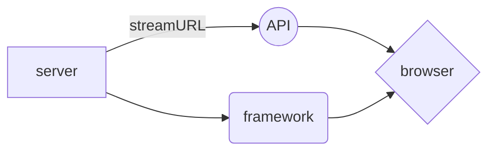

# Welcome to LiveMediaFramework!

The purpose for the project is to build node.js or python based server that will run API for  CLI tools as startup will do all of the testing on Heroku which will be built based on:

> [StreamLink](https://streamlink.github.io/)

# Purpose

Well i hate cat and mouse but want simple interface that is built in browser for easy access don't want to built framework from scratch but instead just modify the existing that are already out there.  

And this will produce a flow chart:

